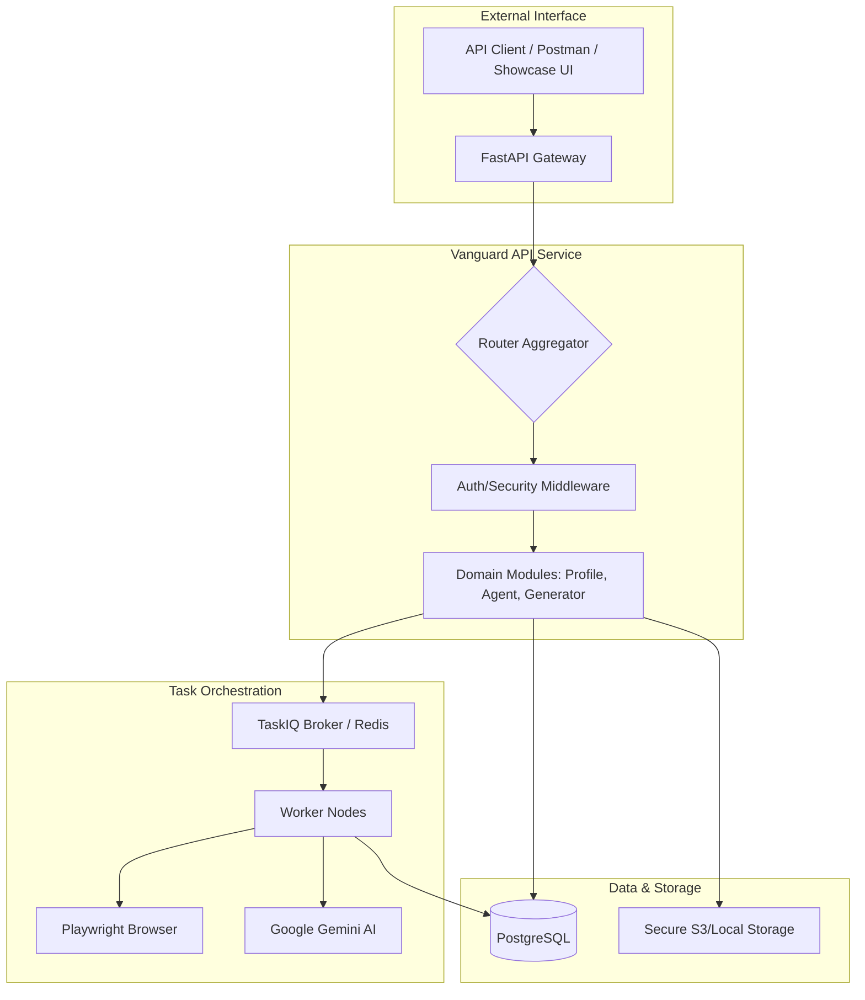
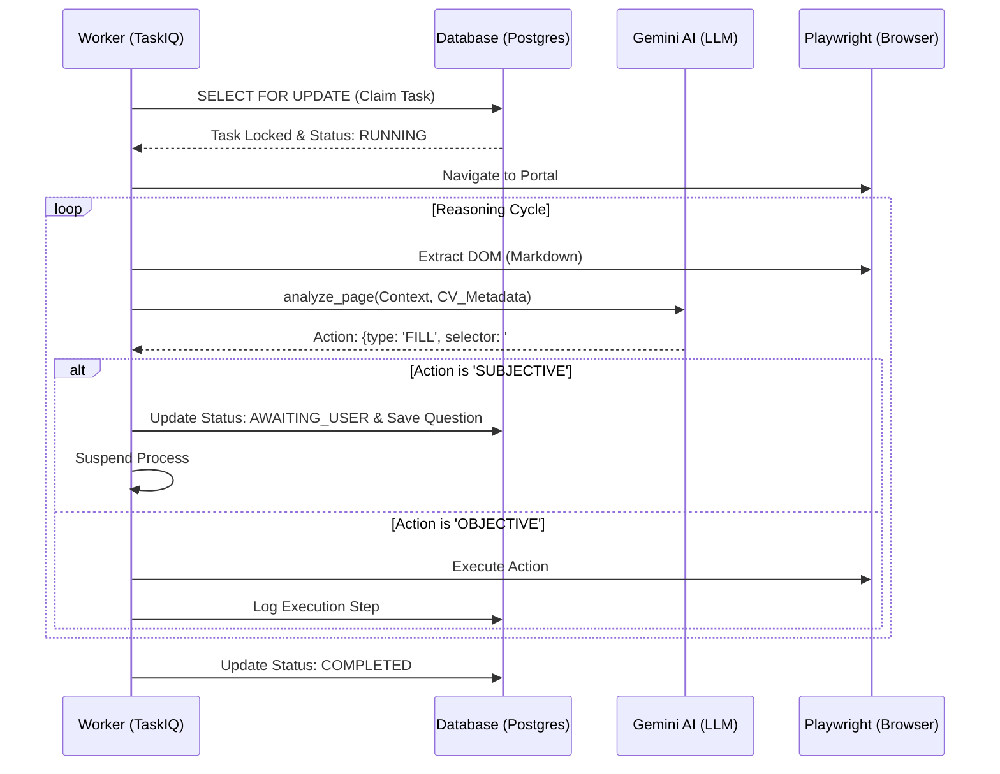

# 🛡️ Vanguard: Master Technical Design Document (TDD)

**Project Name:** Vanguard (AI Job Hunting Copilot)

**Architecture:** Modular MVC / Event-Driven Asynchronous API

**Core Stack:** FastAPI, PostgreSQL, TaskIQ, Playwright, Google Gemini AI.

---

## 1. Architecture Diagrams

### A. High-Level Architecture (HLD)

Menjelaskan aliran sistem dari request user hingga eksekusi worker asinkron.



### B. Low-Level Design (LLD): The Agent reasoning Loop

Detail bagaimana Worker berinteraksi dengan LLM dan Browser untuk mengambil keputusan.



## 2. Security Framework (Zero Trust Approach)

Karena sistem menerima file ZIP dan kredensial portal, keamanan diatur secara berlapis:

1. **File Security:**
* **Malware Scanning:** Integrasi ClamAV sebelum file ZIP dipindahkan ke storage permanen.
* **Sandboxed Extraction:** Ekstraksi ZIP hanya dilakukan di direktori *temporary* yang terisolasi (Chroot/Docker volume).


2. **Data Security:**
* **AES-256 Encryption:** Menggunakan library `cryptography` untuk enkripsi kredensial portal.
* **JWT Token** melakukan verifikasi daripada identitas request yang sedang melakukan komunikasi dengan API
* **Credential Masking:** Menghapus data sensitif dari log sistem.


3. **API Security:**
* **Rate Limiting:** Mencegah *abuse* pada endpoint scraping dan upload.


---

## 3. Testing Pyramid Strategy

Testing dibagi menjadi tiga level untuk memastikan reliabilitas backend.

* **Unit Testing (Fast):** Menguji `core/security.py`, `core/malware_scan.py`, dan Pydantic schemas.
* **Integration Testing (Medium):** Menguji alur `FastAPI -> PostgreSQL` dan `FastAPI -> TaskIQ`.
* **E2E Testing (Slow):** Menguji alur lengkap: Upload ZIP  Scrape Jobs  Tailor CV  Auto-Apply (menggunakan portal demo).

---

## 4. Project Structure
``` tree
vanguard-app/
├── core/                       # Shared Engine
│   ├── database.py             # Tortoise ORM Async + Optimistic Lock Config
│   ├── security.py             # AES-256 & PII Masking
│   ├── ai_engine.py            # Gemini SDK + Phoenix Tracing
│   ├── browser.py              # Playwright Worker Setup
│   └── malware_scan.py         # ClamAV Wrapper
├── modules/                    # Business Domains
│   ├── profile/                # M: Portfolio, V: JSON, C: API
│   ├── agent/                  # M: Task, V: JSON, C: API/WS
│   └── generator/              # M: TailoredDoc, V: JSON, C: API
├── shared/                     # The Contract
│   └── schemas.py              # Pydantic (Input/Output Validation)
├── tests/                      # Testing Suite (Pytest)
│   ├── unit/                   # Security, Parsing, & Logic tests
│   ├── integration/            # API Endpoints & DB Race Condition tests
│   ├── e2e/                    # Full Scraping-to-Apply simulations
│   └── conftest.py             # Fixtures for Mock DB & Async Loop
├── main.py                     # App Entry Point
└── .env.example
```
---

---

## 5. Recommended FOSS Stack (Free & Open Source)

* **LLM:** Google Gemini AI (via SDK).
* **Task Queue:** TaskIQ (Async Python Task Queue).
* **Malware Scan:** ClamAV (Open Source Antivirus).
* **Tracing/Observability:** structlog.
* **Documentation:** swagger.

---


## 6. Concurrency Control (Race Condition Strategy)

| Scenario | Locking Type | Reason |
| --- | --- | --- |
| **Task Claiming** | **Pessimistic** (`FOR UPDATE`) | Mencegah 2 worker mengambil 1 tugas yang sama dari antrean. |
| **Profile Updates** | **Optimistic** (`version` col) | Mencegah tabrakan jika User edit profil saat AI sedang update hasil parsing. |
| **LLM Token Usage** | **Pessimistic** | Memastikan kalkulasi kuota token tetap akurat saat banyak worker aktif. |

---

## 7. Quality Gate: DoR & DoD

### **Definition of Ready (DoR)**

*  **Schema Locked:** Tabel di `models.py` sudah mendukung `version_id_col`.
*  **API Contract:** Pydantic models sudah siap di `shared/schemas.py`.
*  **Security Context:** MIME type file upload sudah ditentukan.

### **Definition of Done (DoD)**

*  **Async Only:** Tidak ada I/O blocking di seluruh modul.
*  **Malware Passed:** File upload wajib melewati `malware_scan.py`.
*  **Test Passed:** Lolos Unit, Integration, dan minimal 1 skenario E2E.
*  **Documented:** swagger docs terupdate otomatis.
*  **Clean Git:** Commit menggunakan standar *Conventional Commits*.