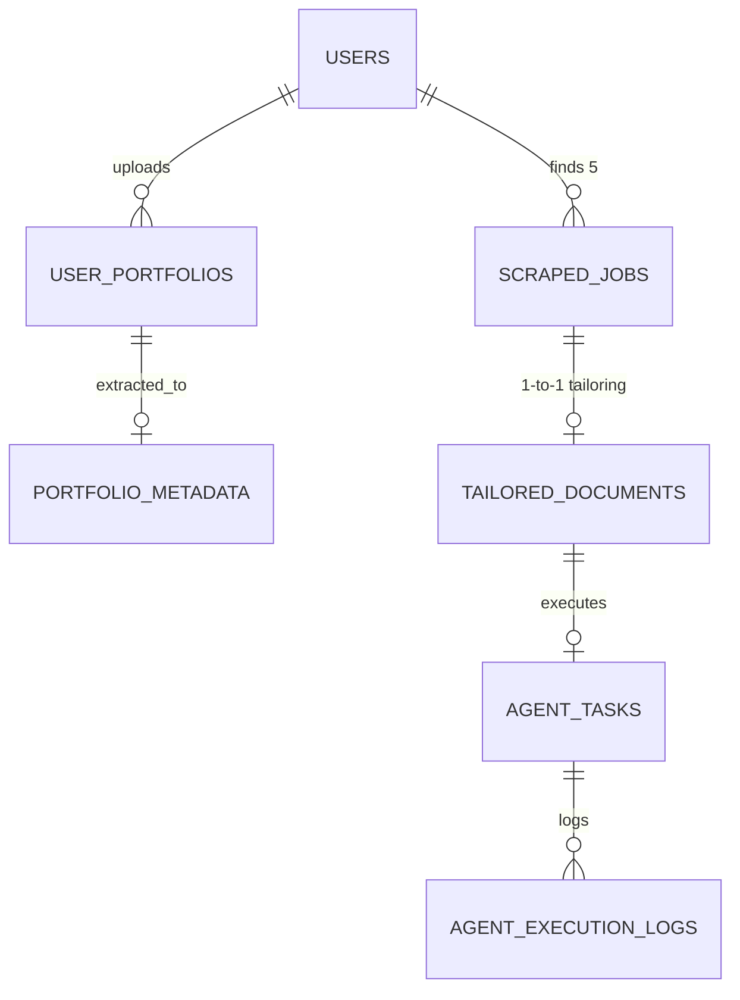

# 🗄️ Vanguard Database Schema (Revised: Backend-Only)

> **PRINSIP UTAMA:**
> 1. **UUID Primary Keys:** Semua ID menggunakan UUID untuk skalabilitas.
> 2. **Audit Ready:** Setiap tabel memiliki `created_at` dan `updated_at`.
> 3. **Security First:** Kredensial dan data sensitif wajib dienkripsi AES-256 sebelum masuk ke DB.

---

## 1. Business Logic Schema (Identity & Portfolio)

Terletak di `modules/profile/models.py`.

### `users`

Tabel identitas utama aplikasi.

* `id`: UUID (PK)
* `email`: String (Unique, Index)
* `hashed_password`: String (Nullable) — *Dikosongkan jika user daftar via Google.*
* **`auth_provider`**: Enum (`LOCAL`, `GOOGLE`) — *Default: `LOCAL`.*
* **`provider_id`**: String (Unique, Nullable) — *Menyimpan ID unik dari Google (Subject ID).*
* **`avatar_url`**: String (Nullable) — *Untuk menyimpan foto profil dari Google.*
* **`is_active`**: Boolean (Default: `True`).
* `password_changed_at`: DateTime (Default: Now).
* `created_at`: DateTime (Default: Now).
* `updated_at`: DateTime (Default: Now) — *Trigger Optimistic Lock via `version` column.*
* **`version`**: Integer (Default: 1) — *Untuk Optimistic Locking.*

### `user_profiles`

Header data profesional user.

* `id`: UUID (PK)
* `user_id`: UUID (FK -> users.id, Cascade)
* `starter_cv_path`: String (Path ke file CV asli di storage aman)
* `summary`: Text (Hasil ekstraksi AI dari CV + Portfolio)
* `target_role`: String

### `user_portfolios`

Manajemen file portfolio dan integrasi eksternal.

* `id`: UUID (PK)
* `user_id`: UUID (FK -> users.id)
* `type`: Enum (ZIP, GITHUB_MCP, FIGMA_MCP)
* `storage_path`: String (Path file ZIP atau URL API)
* `status`: Enum (PENDING, SCANNING, SECURE, INFECTED)
* `malware_scan_report`: JSON (Detail dari scanning API)

### `portfolio_metadata`

Hasil ekstraksi dari isi ZIP/MCP agar tidak perlu membaca file fisik berulang kali.

* `id`: UUID (PK)
* `portfolio_id`: UUID (FK -> user_portfolios.id, Cascade)
* `content_summary`: Text (Penjelasan proyek/isi file)
* `tech_stack`: JSON (Daftar teknologi yang terdeteksi)
* `relevance_score`: Float

---

## 2. Job Discovery & Tailoring Schema

Terletak di `modules/generator/models.py`.

### `scraped_jobs`

Hasil pencarian 5 lowongan kerja paling relevan per sesi.

* `id`: UUID (PK)
* `user_id`: UUID (FK -> users.id)
* `job_title`: String
* `company_name`: String
* `job_description`: Text
* `raw_html`: Text (Untuk audit agent)
* `similarity_score`: Float (Hasil ranking relevansi CV ↔ Job)

### `tailored_documents` 

Pusat penyimpanan CV yang sudah dipersonalisasi untuk setiap lowongan.

* `id`: UUID (PK)
* `job_id`: UUID (FK -> scraped_jobs.id, Cascade)
* `user_id`: UUID (FK -> users.id)
* `doc_type`: Enum (CV, COVER_LETTER, RESYNE)
* `content_markdown`: Text (Konten hasil AI)
* `file_path`: String (Path ke PDF yang digenerate)

---

## 3. Agent & Security Schema

Terletak di `modules/agent/models.py`.

### `user_credentials`

* `id`: UUID (PK)
* `user_id`: UUID (FK -> users.id)
* `portal_name`: String
* `encrypted_username`: Text (AES-256)
* `encrypted_password`: Text (AES-256)

### `agent_tasks` (REVISED)

Manajemen antrean tugas asinkron.

* `id`: UUID (PK)
* `user_id`: UUID (FK -> users.id)
* `task_type`: Enum (DISCOVERY, TAILORING, APPLYING)
* `status`: Enum (QUEUED, RUNNING, AWAITING_USER, COMPLETED, FAILED)
* `subjective_question`: Text (Disimpan jika Agent butuh jawaban user)
* `error_log`: Text

---

## 4. Technical Logging Schema

Terletak di `core/models_tech.py`.

### `agent_execution_logs`

* `id`: BigInt (PK)
* `task_id`: UUID (FK -> agent_tasks.id)
* `message`: Text
* `screenshot_path`: String (Bukti visual jika gagal)
* `timestamp`: DateTime

### `llm_usage_logs`

* `id`: UUID (PK)
* `task_id`: UUID (FK -> agent_tasks.id, Nullable)
* `model_name`: String
* `prompt_tokens`: Integer
* `completion_tokens`: Integer
* `estimated_cost`: Float

---

## 📐 Entity Relationship Diagram (ERD)

### 💡 Catatan Arsitektur:

1. **Normalization (3NF):** Data portfolio dipisah dari profil utama agar user bisa punya banyak project/file pendukung tanpa mengotori tabel profil.
2. **Handling Batching:** Tabel `tailored_documents` memiliki `job_id` sehingga Anda bisa melakukan query sekaligus untuk semua dokumen dalam satu batch proses LLM.
3. **Security Layer:** Kolom `status` di `user_portfolios` menjadi gerbang utama; Agent hanya boleh menyentuh file dengan status `SECURE`.